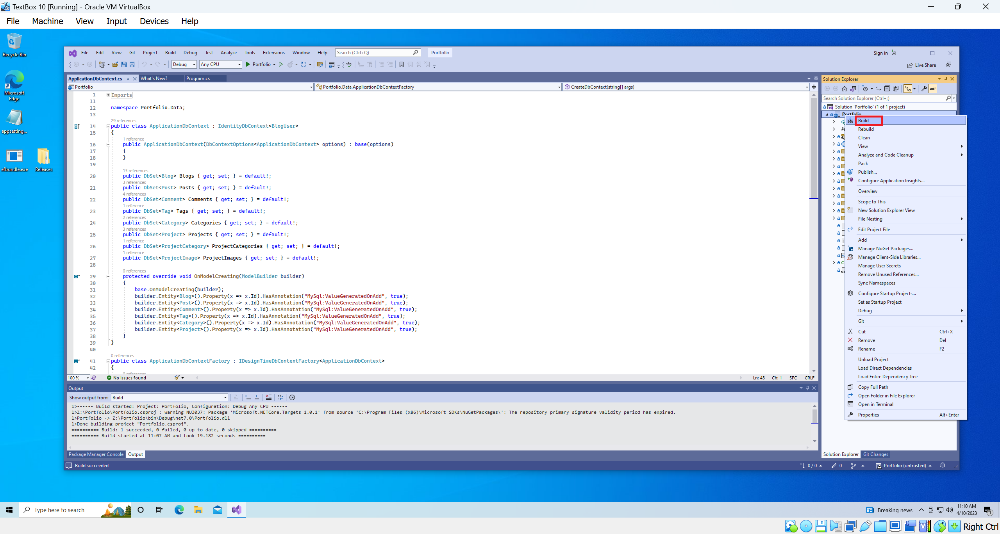

# ://[mikemrobinsondev.com](http://www.mikemrobinsondev.com) codebase.

This is a project written in ASP.NET 7. The purpose of sharing this with the GitHub community is to show the code that I crafted.

I originally built this project because I wanted to start a blog to chronicle my coding journey. So I thought, if I am serious about coding, why not make my first major project a small custom CMS? I am constantly improving this work, so it should be no surprise if the codebase changes over time.

# Features

- Administrators can create, edit, and delete blogs.

- Administrators can create, edit, and delete posts and share them on chosen social media platforms.

- Users can create comments for posts and administrators can moderate comments.

- Administrators can create projects and upload multiple images to them. Users can share projects on chosen social media platforms.

- Users can create an account, upload an avatar, and change account information (needed to post comments).


# Setting up the development environment

To run a local copy of the code, you will have to compile it from source. Please make sure you have the following free software to do so:

[Microsoft Visual Studio Community 2022](https://visualstudio.microsoft.com/downloads/)

- IMPORTANT: When you install visual studio, make sure **ASP.NET and web development** is check (shown below).
  

[Entity Framework Core v6.2.0+](https://learn.microsoft.com/en-us/ef/core/cli/dotnet#installing-the-tools)

[Oracle MySQL v8.0.32+](https://dev.mysql.com/downloads/)

# Running the software

## A word of warning

The purpose of making this repo public is perusal. There are external services that are needed and errors will occur if you try to run this code without them. If you want to set up these services to get a copy of this code running on your machine, please follow the steps below.

1.  Use Git to clone the repo to your machine.

2.  Once the repo has is on your machine, open the solution in visual studio.

3.  If you haven't done so already, make sure that EFCore is installed globally on your machine. You can do this from the command line by running the following `dotnet tool install --global dotnet-ef`.

4.  In the root of the project folder, you will find appsettings.json.sample, rename the file to appsettings.json and fill it out to match your setup (See below, and replace information in brackets with your information, please do not include the brackets when entering your info 😁).

    ```JSON
    {
      "ConnectionStrings": {
        "Production": "server=[MySQL Server IP Address];userid=[MySQL UserName];pwd=[MySQL Password];port=3306;database=portfolio;"
      },
    
      "GoogleAccount": {
        "auth_provider_x509_cert_url": "https://www.googleapis.com/oauth2/v1/certs",
        "auth_uri": "https://accounts.google.com/o/oauth2/auth",
        "client_id": "[Your Google Client ID]",
        "client_secret": "[Your Google Secret]",
        "project_id": "[Your Google Client ID]",
        "redirect_uris": ["Your redirect URI"],
        "token_uri": "https://oauth2.googleapis.com/token"
      },
    
      "AppSettings": {
        "MailSettings": {
          "DisplayName": "[Your Display Name]",
          "Host": "[Your SMTP Server]",
          "Mail": "[Your SMTP Email Address]",
          "Password": "[Your SMTP Email Password]",
          "Port": 587
        }
      },
    
      "ReCaptcha": {
        "SiteKey": "[Your Recaptcha Site Key]",
        "SecretKey": "[Your Recaptcha Secret]",
        "Version": "v2",
        "UseRecaptchaNet": false
      }
    }
    ```
5.  In visual studio, under the Solution explorer, right click the solution and select Build (shown below). This will create a **bin** folder in the **project** folder.
    

6.  Navigate to **Portfolio** > **bin** > **debug** > **net7.0** and place your custom **appsettings.json** file in the directory (shown below).
    

7.  Navigate one directory up from **Portfolio** and create a directory called **ArticleImages** (shown below) This will hold images for most entities in the application.
    

8.  In visual studio, go to Tools > NuGet Package Manager > Package Manager Console (shown below). This will open a new tab in Visual Studio.
     

9.  In the package manager console, type `Update-Database` (shown below).
    

10. With all of these steps complete, you can now execute the program (shown below).
    

Thanks for you interest in this code, if you have any questions on getting the project setup, please reach out through [email](mailto:michael.robinson@mikemrobinsondev.com?subject=I%20need%20help%20setting%20up%20your%20portfolio%20code&body=I%20need%20help%20with%20your%20project%20code.)

 


    


